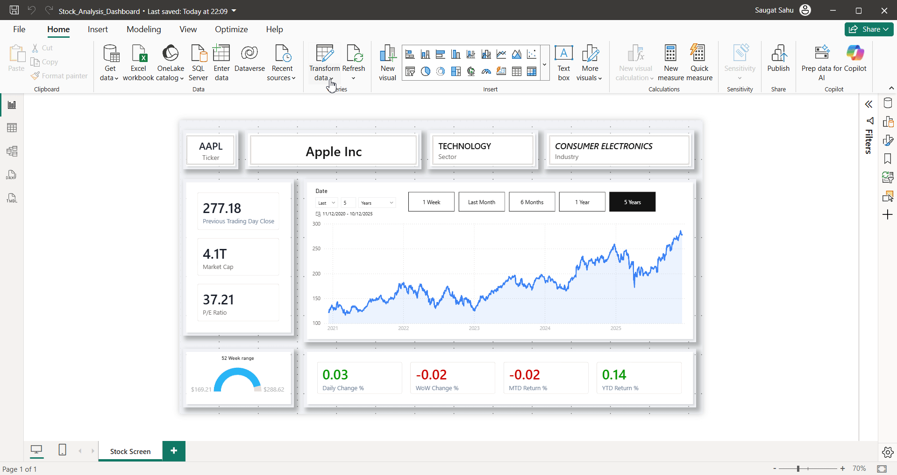
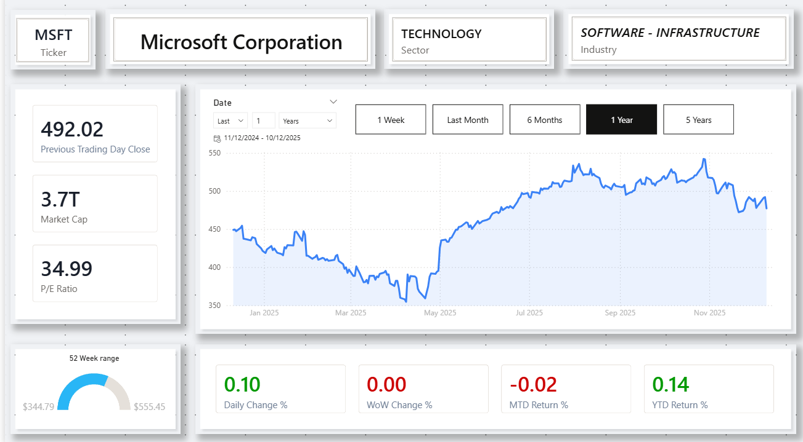
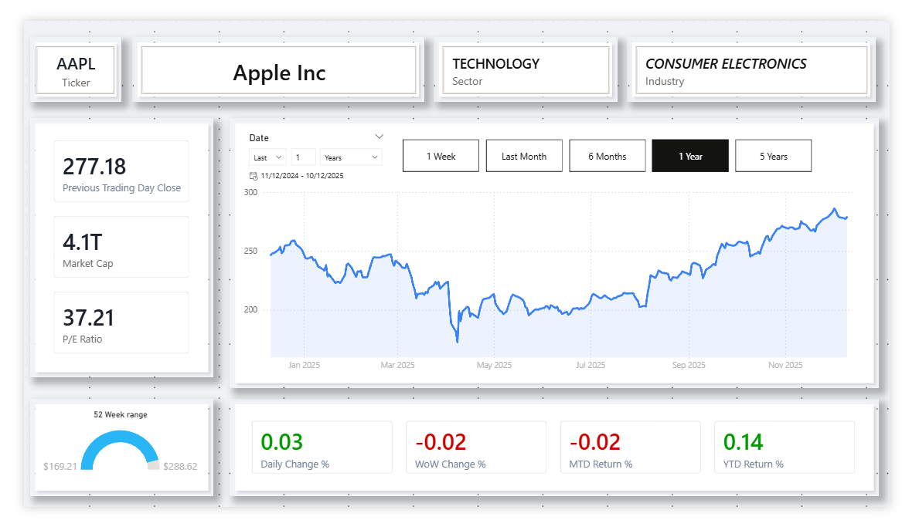

#  Dynamic Stock Market Analysis Dashboard

##  Project Overview
This project is a dynamic Power BI dashboard designed to analyze stock market performance for any given company. It connects to live financial data and visualizes key metrics, allowing for a comprehensive overview of a stock's health at a glance.

**Key Features:**
* **Dynamic Data Fetching:** The dashboard uses Power Query parameters to fetch data for specific stock tickers.
* **Time-Series Analysis:** Interactive line charts with slicers for 1W, 1M, 6M, 1Y, and 5Y views.
* **Key Performance Indicators (KPIs):** Real-time tracking of Market Cap, P/E Ratio, and Previous Close.

## Live Demo
*Watching the dashboard update dynamically as the parameter is switched from **AAPL** to **MSFT**:*

---

## Static Views

### View 1: The Result (Microsoft Analysis)

### View 2: The Starting Point (Apple Analysis)

---

## How to Use This Project
1.  **Download** the `Dynamic_Stock_Dashboard.pbix` file from the file list above.
2.  Open in **Power BI Desktop**.
3.  To change the company being analyzed:
    * Go to **Home** > **Transform Data** > **Edit Parameters**.
    * Enter a new valid Ticker Symbol (e.g., `GOOGL`, `TSLA`).
    * Click **OK**.
4.  **Crucial Step:** A light red banner will appear at the top of the canvas. Click **"Apply Changes"** to fetch the new data.
5.  **Important Note:** When running inside Power BI Desktop, you must use **Ctrl + Click** to activate buttons (e.g., Time Period selectors) or follow navigation links.
